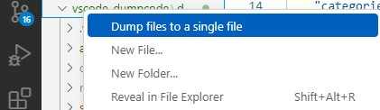

# Dump Sources

"Dump Sources" is a Visual Studio Code extension designed to help you quickly aggregate text-based source files from a specific directory into a single output file. This is particularly useful when preparing code for large language models (LLMs) or when you need a consolidated view of certain files for review, documentation, or analysis.



↓

```txt
########## .gitignore ##########
out
dist
...

########## .prettierrc ##########
{
  "tabWidth": 4
}

########## package.json ##########
{
    "name": "dump-sourcecode",
    ...

########## src\extension.ts ##########
import * as vscode from "vscode";
...
```

## Key Features

-   **Bulk Code Input for AI**: Easily combine source code files from a chosen directory into one output file, perfect for providing a single large input to AI models.
-   **Directory-Scoped Collection**: Simply right-click on a target folder in the Explorer to gather only the files under that directory.
-   **.gitignore Support**: Automatically skip files and directories that match `.gitignore` rules, ensuring that only relevant files are included.
-   **Flexible Configuration**:
    -   Customize the output filename
    -   Specify a list of file/directory patterns to exclude

## How to Use

1. Open your target project in VS Code.
2. In the Explorer, right-click the folder you want to dump sources from.
3. Select **"Dump Sources"** from the context menu.
4. The extension will find all files matching the configured extensions (excluding those ignored by `.gitignore`).
5. While processing, a progress indicator will animate at the bottom of the VS Code window.
6. Once complete, the generated file opens automatically in the editor, allowing you to review the combined content immediately.

## Extension Settings

#### `dumpSource.outputFileName`

-   Type: string
-   Default: "dump.txt"
-   Description: Specifies the name of the file where aggregated content will be stored.
-   Example: "merged_sources.txt"

#### `dumpSource.extensions`

-   Type: array of string
-   Default: ["*.md", ".vscode", "package-lock.json"]
-   Description: A list of file and directory patterns to ignore during processing. Patterns use .gitignore-like syntax, supporting wildcards (\*, \*\*).
-   Examples:
    -   `["*.md"]`: Ignore all Markdown files.
    -   `["dir/**/*.txt"]`: Ignore all .txt files within the dir directory and its subdirectories.

## Use Cases

-   Provide large sections of code to AI models for analysis or suggestions.
-   Extract and consolidate specific parts of a project for focused reviews.
-   Create a single reference document from multiple source files for documentation or archiving.

With the Dump Sources Extension, you can streamline your code aggregation process, making it easier to work with AI tools or gain insights from a defined subset of files. Try it out and speed up your code management workflow!

## LICENSE

See [LICENSE.md](./LICENSE.md) file.

**Enjoy!**
