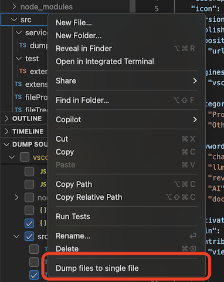

# Dump Sources Extension

> A VS Code extension to collect and export source files from a folder, either as a single text file or directly to the clipboard.


## Key Features

-   **Two Modes of Operation**:

    1. **Explorer Context Menu**: Quickly dump all source files in any folder via right-click, output to a file or clipboard.
    2. **Dump Sourcecode Tree View**: Fine-grained file selection with a dedicated tree view (clipboard only).

-   **Commands**:

    -   Dump files to a single file.
    -   Dump files to the clipboard.
    -   Refresh or clear selections in the tree view.

## Usage

### 1. Explorer Context Menu

1. In the **Explorer**, right-click on a folder.
2. Choose **Dump files to single file** or **Dump files to Clipboard**.
3. (File mode only) The output file is created at the workspace root with the name set by `dumpSource.outputFileName`.



### 2. Dump Sourcecode Tree View

1. Open the **Dump Sourcecode** view from the Explorer sidebar.
2. Click the **Refresh** icon to scan for text-based source files.
3. Expand folders and click items to select.
4. Use the **Copy Selected** command (via view title or context menu) to copy contents to the clipboard.

> **Note**: Tree view mode supports **clipboard output only**.


## Commands Reference

| Command                                   | Title                     | Context                                    |
| ----------------------------------------- | ------------------------- | ------------------------------------------ |
| `dump-sourcecode.dump_files_to_file`      | Dump files to single file | Explorer context (folder only)             |
| `dump-sourcecode.dump_files_to_clipboard` | Dump files to Clipboard   | Explorer context (folder only) + Tree view |
| `dump-sourcecode.refreshTree`             | Refresh Tree              | Tree view                                  |
| `dump-sourcecode.clearSelection`          | Clear Selection           | Tree view                                  |
| `dump-sourcecode.copySelected`            | Copy Selected             | Tree view                                  |

## Configuration

Under **Preferences › Settings › Dump Sourcecode**, configure:

| Setting                         | Default                                    | Applies When                                                                                                            |
| ------------------------------- | ------------------------------------------ | ----------------------------------------------------------------------------------------------------------------------- |
| `dumpSource.outputFileName`     | `aggregated_sources.txt`                   | Explorer context **file** mode                                                                                          |
| `dumpSource.userIgnorePatterns` | `["*.md", ".vscode", "package-lock.json"]` | Both modes (filters files to include)                                                                                   |
| `dumpSource.defaultDumpTarget`  | `clipboard`                                | Explorer context (sets default action)                                                                                  |
| `dumpSource.revealFocus`        | `true`                                     | Whether the Dump Sourcecode tree takes focus when revealing the active file; set to `false` to keep focus in the editor |

### Sample Configuration

```json
{
    "dumpSource.outputFileName": "all_sources.txt",
    "dumpSource.userIgnorePatterns": ["*.test.ts", "node_modules"],
    "dumpSource.defaultDumpTarget": "file",
    "dumpSource.revealFocus": true
}
```

## Getting Started

1. Clone the repository:

    ```bash
    git clone https://github.com/hirohitokato/vscode_dumpcode.git
    ```

2. Open in VS Code.
3. Press `F5` to launch the Extension Development Host.
4. Use the commands as described above.

## Release Notes

### 2.0.6

-   Added the ability to open content when clicking on a file in the tree view.

### 2.0.5

-   Discontinued ignoring files described in .vscodeignore

### 2.0.2

-   Refined README with usage scenarios and settings clarity.

### 2.0.1

-   Introduced tree view and flexible output modes. See settings for more details.

### 1.0.0

-   Initial release: basic file dumping functionality.

_Published by [hkato193](https://github.com/hirohitokato)_
